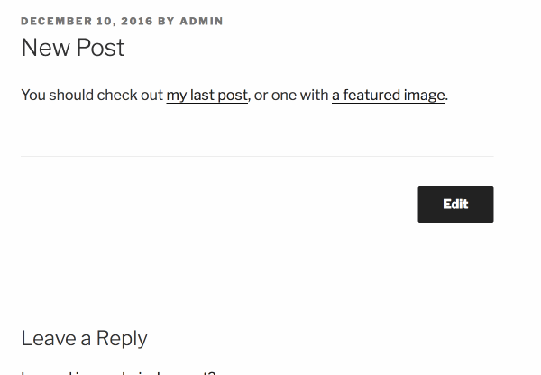

# Hovercards

Show previews of your posts on hover.

## Installation

1. Clone this repository
2. `npm install`
3. `npm run build`
4. Activate the plugin.

## Development

1. Clone this repository.
2. `npm install`
3. Add `define( 'HOVERCARDS_DEV', true )` to your wp-config.
4. Activate the plugin.
5. `npm start`

## Credits

Created as a little hack project by [Ryan McCue](https://rmccue.io/).

The JavaScript tooling in this plugin is based on [Create React App](https://github.com/facebookincubator/create-react-app); you may also want to read [the documentation for that](https://github.com/facebookincubator/create-react-app/blob/master/packages/react-scripts/template/README.md).

Includes the React library by Facebook, licensed under the BSD license.

See [license.txt](license.txt) for full license details.
